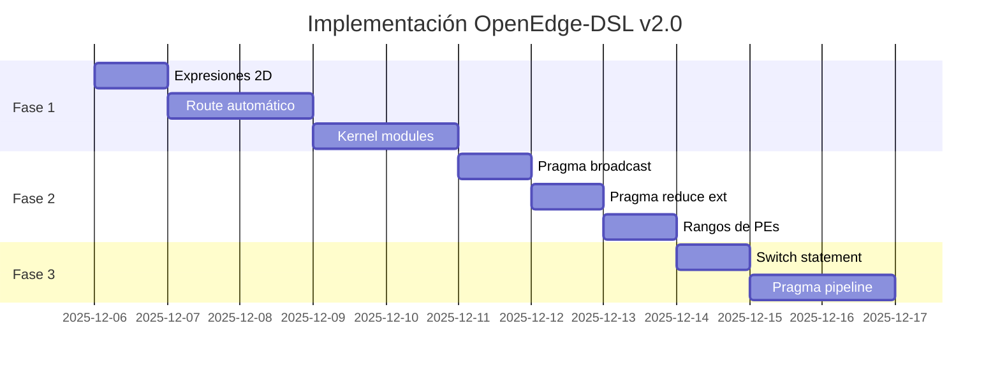

# Proposal v3: Características Avanzadas para OpenEdge-DSL

[← Back to Index](../README.md) | [Proposal v1](./Proposal_v1.md) | [Proposal v2](./Proposal_v2.md)

---

## Resumen Ejecutivo

Esta propuesta introduce un conjunto de características avanzadas para OpenEdge-DSL v2.0, enfocadas en tres pilares:

1. **Composición de Kernels**: Reutilización de código y modularidad
2. **Routing Inteligente**: Movimiento de datos automatizado entre PEs
3. **Expresividad Mejorada**: Sintaxis más potente y productiva

**Estado:** 📋 Propuesto  
**Versión Objetivo:** 2.0  
**Fecha:** 2025-12-05

---

## Tabla de Contenidos

1. [Kernel Modules](#1-kernel-modules---composición-modular)
2. [Route Automático](#2-route---routing-multi-hop-automático)
3. [Expresiones en Índices 2D](#3-expresiones-complejas-en-índices-2d)
4. [Pragma Broadcast](#4-pragma-broadcast---difusión-eficiente)
5. [Pragma Reduce Extendido](#5-pragma-reduce-extendido)
6. [Switch Statement](#6-switch-statement)
7. [Rangos de PEs](#7-rangos-de-pes-en-coordenadas)
8. [Pragma Pipeline](#8-pragma-pipeline---procesamiento-de-streams)
9. [Plan de Implementación](#plan-de-implementación)

---

## 1. Kernel Modules - Composición Modular

### Motivación

Los algoritmos criptográficos (Barrett, S-box, FFT) comparten patrones de código que actualmente requieren copiar y pegar. Las funciones existentes son útiles pero:

- No soportan múltiples ciclos de forma natural
- No tienen semántica de "unidad reutilizable"
- No permiten composición clara entre etapas de un pipeline

### Sintaxis Propuesta

```c
// Definición de módulo
kernel_module butterfly_radix2(a: R0, b: R1, twiddle: R2, out_a: R0, out_b: R1) {
    // Múltiples ciclos permitidos
    cycle { @0,0: SMUL R3, b, twiddle; }   // temp = b * twiddle
    cycle { @0,0: SADD out_a, a, R3; }     // out_a = a + temp
    cycle { @0,0: SSUB out_b, a, R3; }     // out_b = a - temp
}

kernel_module barrett_reduce(x: R0, mu: R1, m: R2, result: R0) {
    cycle { @0,0: SMUL R3, x, mu; }        // q = x * mu
    cycle { @0,0: SRT R3, R3, IMM(16); }   // q = q >> 16
    cycle { @0,0: SMUL R3, R3, m; }        // q = q * m
    cycle { @0,0: SSUB result, x, R3; }    // result = x - q
}

// Uso en kernel principal
kernel "crypto_pipeline" {
    config(0xF, 0);

    cycle { @0,0: LWI R0, input[0]; }
    
    // Inline expande el módulo en este punto (zero overhead)
    inline barrett_reduce(x=R0, mu=MU_CONST, m=MODULUS, result=R0);
    
    // Encadenar otro módulo
    inline sbox_lookup(input=R0, output=R1);
    
    cycle { @0,0: SWI R1, output[0]; }
    cycle { @0,0: EXIT; }
}
```

### Semántica

| Aspecto | Comportamiento |
|---------|----------------|
| **Parámetros** | Sustituidos textualmente antes de expansión |
| **Ciclos** | Numerados secuencialmente desde el punto de inserción |
| **Labels** | Prefijados automáticamente: `label` → `_modulename_label` |
| **Anidamiento** | Módulos pueden llamar a otros módulos |
| **Registros** | Sin colisión si se usan parámetros correctamente |

### Diferencia con Functions

| Característica | `function` | `kernel_module` |
|---------------|------------|-----------------|
| Múltiples ciclos | Limitado | ✅ Nativo |
| Parámetros tipados | No | ✅ Sí (registro) |
| Semántica | Macro textual | Unidad componible |
| Labels internos | Manual | ✅ Auto-prefijado |
| Uso típico | 1 ciclo, 1-2 instrucciones | Pipelines completos |

### Implementación

**Archivos a modificar:**
- `src/core/dsl/tokenizer.ts`: Keywords `kernel_module`, `inline`
- `src/core/dsl/parser/module-parser.ts`: Nuevo parser para módulos
- `src/utils/dsl-compiler.ts`: Almacenar y expandir módulos

**Estimación:** ~300-400 líneas de código

---

## 2. Route - Routing Multi-Hop Automático

### Motivación

Mover datos entre PEs no adyacentes requiere escribir manualmente cada hop:

```c
// Actualmente: Manual y propenso a errores
cycle { @0,0: SADD ROUT, R0, ZERO; }
cycle { @0,1: SADD ROUT, RCL, ZERO; }
cycle { @0,2: SADD ROUT, RCL, ZERO; }
cycle { @0,3: SADD ROUT, RCL, ZERO; }
cycle { @1,3: SADD R1, RCT, ZERO; }
// ... 6+ ciclos para mover de @0,0 a @3,3
```

### Sintaxis Propuesta

```c
// Routing automático (ruta óptima)
route @0,0.R0 to @3,3.R1;

// Con preferencia de dirección
route @0,0.R0 to @3,3.R1 via horizontal;    // Primero cols, luego rows
route @0,0.R0 to @3,3.R1 via vertical;      // Primero rows, luego cols
route @0,0.R0 to @3,3.R1 via shortest;      // Ruta más corta (default)

// Routing toroidal (wrap-around)
route @0,0.R0 to @3,0.R1 via toroidal;      // Usa edge negativo

// Con waypoints específicos
route @0,0.R0 to @3,3.R1 via [(0,2), (2,2)];
```

### Algoritmo de Generación

El compilador usa `toroidal-routing.ts` (ya existente) para:

1. Calcular ruta óptima entre origen y destino
2. Generar ciclos con `SADD ROUT, RCx, ZERO` para cada hop
3. En destino: `SADD destReg, RCx, ZERO`

**Ejemplo de expansión:**

```c
// Entrada
route @0,0.R0 to @2,3.R1;

// Generado (ruta horizontal-first)
cycle { @0,0: SADD ROUT, R0, ZERO; }     // Iniciar desde R0
cycle { @0,1: SADD ROUT, RCL, ZERO; }    // Hop →
cycle { @0,2: SADD ROUT, RCL, ZERO; }    // Hop →
cycle { @0,3: SADD ROUT, RCL, ZERO; }    // Hop →
cycle { @1,3: SADD ROUT, RCT, ZERO; }    // Hop ↓
cycle { @2,3: SADD R1, RCT, ZERO; }      // Destino
```

### Visualización en UI

El simulador puede mostrar:
- Ruta activa resaltada en el grid
- Animación del dato moviéndose
- Información de latencia

### Implementación

**Archivos a modificar:**
- `src/core/dsl/tokenizer.ts`: Keyword `route`, `to`, `via`
- `src/core/dsl/parser/route-parser.ts`: Parser para sintaxis route
- `src/utils/dsl-compiler.ts`: Integrar `calculateOptimalRoute()`
- `src/utils/toroidal-routing.ts`: Ya existe, solo integrar

**Estimación:** ~200-300 líneas de código

---

## 3. Expresiones Complejas en Índices 2D

### Motivación

Actualmente los índices 2D solo soportan expresiones simples:

```c
.data2d M[4][4]

// Funciona
M[i][j]
M[0][1]

// NO funciona (requerido para stencils)
M[i+1][j]
M[i-1][j]
M[i][j+1]
M[i][j-1]
```

### Sintaxis Propuesta

```c
.data2d image[8][8]
.data2d output[6][6]

kernel "Convolution3x3" {
    config(0xF, 0);

    for i in range(1, 7) {
        for j in range(1, 7) {
            // Cargar vecindario 3x3
            cycle { @i,j: LWI R0, image[i-1][j-1]; }  // Top-left
            cycle { @i,j: LWI R1, image[i-1][j];   }  // Top
            cycle { @i,j: LWI R2, image[i-1][j+1]; }  // Top-right
            cycle { @i,j: LWI R3, image[i][j-1];   }  // Left
            // ... continuar con kernel de convolución
        }
    }
}
```

### Expresiones Soportadas

| Expresión | Ejemplo | Evaluación |
|-----------|---------|------------|
| Variable simple | `i`, `j` | Valor de loop |
| Suma/Resta constante | `i+1`, `j-1` | Compile-time |
| Multiplicación | `i*2` | Compile-time |
| División | `i/2` | Compile-time (entero) |
| Módulo | `i%4` | Compile-time |
| Combinaciones | `(i+1)*2` | Compile-time |
| Con constantes | `i+OFFSET` | Resuelve `.const` |

### Validación en Compile-Time

```c
.data2d M[4][4]

// Error: Row index -1 out of bounds
for i in range(4) {
    cycle { @0,0: LWI R0, M[i-1][0]; }  // Error cuando i=0
}

// Correcto: Start from 1
for i in range(1, 4) {
    cycle { @0,0: LWI R0, M[i-1][0]; }  // OK: i-1 = 0,1,2
}
```

### Implementación

**Archivos a modificar:**
- `src/core/dsl/parser/expression-parser.ts`: Evaluar expresiones complejas
- `src/core/dsl/parser/data2d-parser.ts`: Resolver índices con expresiones
- `src/utils/dsl-compiler.ts`: Validación de bounds

**Estimación:** ~150-200 líneas de código

---

## 4. Pragma Broadcast - Difusión Eficiente

### Motivación

Cargar el mismo valor en múltiples PEs requiere código repetitivo:

```c
// Actualmente: Manual
cycle {
    @0,0: SADD R0, ZERO, IMM(42);
    @0,1: SADD R0, ZERO, IMM(42);
    @0,2: SADD R0, ZERO, IMM(42);
    @0,3: SADD R0, ZERO, IMM(42);
}
```

### Sintaxis Propuesta

```c
// Broadcast a toda una fila (horizontal)
#pragma broadcast(value=R0, from=@0,0, to=row)
// Genera cadena: @0,1: SADD R0, RCL, ZERO; @0,2: ... @0,3: ...

// Broadcast a toda una columna (vertical)
#pragma broadcast(value=R0, from=@0,0, to=column)
// Genera: @1,0: SADD R0, RCT, ZERO; @2,0: ... @3,0: ...

// Broadcast a todo el grid (primero row, luego column de cada PE)
#pragma broadcast(value=R0, from=@0,0, to=all)

// Con número de ciclos especificado
#pragma broadcast(value=R0, from=@0,0, to=row, cycles=1)
// Todos en paralelo (requiere valor ya cargado vía LWI)
```

### Modos de Broadcast

| Modo | Ciclos | Comportamiento |
|------|--------|----------------|
| `row` | 3 | Propaga horizontalmente via RCL/RCR |
| `column` | 3 | Propaga verticalmente via RCT/RCB |
| `all` | 6 | Primero row, luego column desde cada PE |
| `instant` | 1 | Todos cargan mismo valor (vía IMM o LWI) |

### Implementación

**Archivos a modificar:**
- `src/core/dsl/pragma-handler.ts`: Nuevo handler para broadcast
- `src/utils/dsl-compiler.ts`: Generar ciclos de propagación

**Estimación:** ~100-150 líneas de código

---

## 5. Pragma Reduce Extendido

### Estado Actual

`#pragma reduce` soporta: `sum`, `max`, `min`, `and`, `or`

### Extensiones Propuestas

```c
// XOR - Crítico para criptografía
#pragma reduce(op=xor, src=R0, dest=R1)

// Reducción por columna (vertical)
#pragma reduce(op=sum, src=R0, dest=R1, direction=column)
// Row0 + Row1 + Row2 + Row3 → resultado en Row3

// Reducción de fila específica
#pragma reduce(op=sum, src=R0, dest=R1, row=2)
// Solo reduce la fila 2

// Producto (multiplicación)
#pragma reduce(op=mul, src=R0, dest=R1)

// Promedio (sum / count)
#pragma reduce(op=avg, src=R0, dest=R1)
```

### Nuevas Operaciones

| Operación | Instrucción | Uso Típico |
|-----------|-------------|------------|
| `xor` | LXOR | Checksums, criptografía |
| `mul` | SMUL | Productos acumulados |
| `avg` | SADD + SRT | Promedios (shift por 2) |
| `nand` | LNAND | Lógica combinacional |

### Implementación

**Archivos a modificar:**
- `src/core/dsl/pragma-handler.ts`: Extender `generateReduceTokens()`

**Estimación:** ~80-120 líneas de código

---

## 6. Switch Statement

### Motivación

Múltiples condiciones if-else-if son verbosas:

```c
// Actualmente: Verboso
if (R0 == IMM(0)) @0,0 {
    cycle { @0,0: SADD R1, ZERO, IMM(100); }
} else {
    if (R0 == IMM(1)) @0,0 {
        cycle { @0,0: SADD R1, ZERO, IMM(200); }
    } else {
        cycle { @0,0: SADD R1, ZERO, IMM(0); }
    }
}
```

### Sintaxis Propuesta

```c
// Switch básico
switch (R0) @0,0 {
    case 0:
        cycle { @0,0: SADD R1, ZERO, IMM(100); }
        break;
    case 1:
        cycle { @0,0: SADD R1, ZERO, IMM(200); }
        break;
    case 2:
        cycle { @0,0: SADD R1, ZERO, IMM(300); }
        break;
    default:
        cycle { @0,0: SADD R1, ZERO, IMM(0); }
}

// Switch con rangos
switch (R0) @0,0 {
    case 0..3:   // Rango 0-3 inclusive
        cycle { @0,0: SADD R1, R0, IMM(10); }
        break;
    case 4..7:
        cycle { @0,0: SMUL R1, R0, IMM(2); }
        break;
    default:
        cycle { @0,0: NOP; }
}
```

### Generación de Código

**Estrategia para casos consecutivos:**
```c
// Generado para switch(R0) con casos 0,1,2
_switch_0_start:
    BLT R0, IMM(0), _switch_0_default    // if R0 < 0 → default
    BGE R0, IMM(3), _switch_0_default    // if R0 >= 3 → default
    // Jump table o cadena de BEQ
    BEQ R0, IMM(0), _switch_0_case_0
    BEQ R0, IMM(1), _switch_0_case_1
    JUMP _switch_0_case_2
_switch_0_case_0:
    SADD R1, ZERO, IMM(100)
    JUMP _switch_0_end
_switch_0_case_1:
    SADD R1, ZERO, IMM(200)
    JUMP _switch_0_end
_switch_0_case_2:
    SADD R1, ZERO, IMM(300)
    JUMP _switch_0_end
_switch_0_default:
    SADD R1, ZERO, IMM(0)
_switch_0_end:
```

### Implementación

**Archivos a modificar:**
- `src/core/dsl/tokenizer.ts`: Keywords `switch`, `case`, `default`, `break`
- `src/core/dsl/parser/switch-parser.ts`: Parser para switch
- `src/utils/dsl-compiler.ts`: Generar estructura de saltos

**Estimación:** ~200-250 líneas de código

---

## 7. Rangos de PEs en Coordenadas

### Motivación

Código paralelo simple requiere listar cada PE:

```c
// Actualmente: Verboso
cycle {
    @0,0: LWI R0, data[0];
    @0,1: LWI R0, data[1];
    @0,2: LWI R0, data[2];
    @0,3: LWI R0, data[3];
}
```

### Sintaxis Propuesta

```c
// Rango continuo
cycle {
    @0,[0-3]: LWI R0, data[col];  // col = variable implícita (0,1,2,3)
}

// Rango de filas
cycle {
    @[0-3],0: SADD R0, ZERO, row; // row = variable implícita
}

// Lista específica
cycle {
    @0,[0,2]: SADD R0, R0, R0;  // Solo cols 0 y 2
}

// Cuadrante 2x2
cycle {
    @[0-1],[0-1]: SMUL R0, R0, R0;
}

// Row como variable
@[0-3],0: SADD R0, ZERO, IMM(row);  // R0 = 0,1,2,3 respectivamente
```

### Variables Implícitas

| Variable | Disponible en | Valor |
|----------|---------------|-------|
| `row` | `@[range],col:` | Índice de fila actual |
| `col` | `@row,[range]:` | Índice de columna actual |
| Ambas | `@[r],[c]:` | Ambos índices |

### Implementación

**Archivos a modificar:**
- `src/core/dsl/parser/coordinate-parser.ts`: Parser para rangos
- `src/utils/dsl-compiler.ts`: Expandir rangos a instrucciones

**Estimación:** ~100-150 líneas de código

---

## 8. Pragma Pipeline - Procesamiento de Streams

### Motivación

Procesar streams de datos con máxima eficiencia requiere mantener múltiples datos "en vuelo":

```c
// Sin pipeline: 4 ciclos por dato
for i in range(N) {
    cycle { @0,0: LWI R0, input[i]; }
    cycle { @0,0: SMUL R1, R0, coef; }
    cycle { @0,0: SADD R2, R1, acc; }
    cycle { @0,0: SWI R2, output[i]; }
}
// Total: 4N ciclos
```

### Sintaxis Propuesta

```c
// Pipeline espacial: cada etapa en un PE diferente
#pragma pipeline(depth=4)
for i in range(N) {
    stage(0) @0,0 { LWI R0, input[i]; }      // Etapa 1: Cargar
    stage(1) @1,0 { SMUL R1, R0, coef; }     // Etapa 2: Multiplicar
    stage(2) @2,0 { SADD R2, R1, acc; }      // Etapa 3: Acumular
    stage(3) @3,0 { SWI R2, output[i]; }     // Etapa 4: Almacenar
}
// Total: N + 3 ciclos (pipeline fill + drain)
// Throughput: 1 dato/ciclo después del fill
```

### Semántica de Pipeline

```
Ciclo 0: [Load i=0]  [  -  ]     [  -  ]    [  -  ]
Ciclo 1: [Load i=1]  [Mul i=0]   [  -  ]    [  -  ]
Ciclo 2: [Load i=2]  [Mul i=1]   [Add i=0]  [  -  ]
Ciclo 3: [Load i=3]  [Mul i=2]   [Add i=1]  [Store i=0]  ← Full pipeline
Ciclo 4: [Load i=4]  [Mul i=3]   [Add i=2]  [Store i=1]
...
```

### Opciones Avanzadas

```c
// Pipeline con comunicación explícita
#pragma pipeline(depth=4, comm=RCB)
for i in range(N) {
    stage(0) @0,0 { LWI R0, input[i]; }
    stage(1) @1,0 { SMUL R1, RCT, coef; }  // Lee de etapa anterior via RCT
    stage(2) @2,0 { SADD R2, RCT, acc; }
    stage(3) @3,0 { SWI RCT, output[i]; }
}

// Pipeline horizontal (por columnas)
#pragma pipeline(depth=4, direction=horizontal)
for i in range(N) {
    stage(0) @0,0 { LWI R0, input[i]; }
    stage(1) @0,1 { SMUL R1, RCL, coef; }
    stage(2) @0,2 { SADD R2, RCL, acc; }
    stage(3) @0,3 { SWI RCL, output[i]; }
}
```

### Implementación

**Archivos a modificar:**
- `src/core/dsl/pragma-handler.ts`: Handler para pipeline
- `src/core/dsl/parser/pipeline-parser.ts`: Parser para stage syntax
- `src/utils/dsl-compiler.ts`: Generar prologue/epilogue y ciclos

**Estimación:** ~250-350 líneas de código

---

## Plan de Implementación

### Fase 1: Fundamentos (Prioridad Alta)

| # | Característica | Esfuerzo | Dependencias | Valor |
|---|----------------|----------|--------------|-------|
| 1 | Expresiones en índices 2D | ~150 LOC | Ninguna | ⭐⭐⭐⭐⭐ |
| 2 | Route automático | ~250 LOC | toroidal-routing.ts | ⭐⭐⭐⭐⭐ |
| 3 | Kernel modules + inline | ~350 LOC | Ninguna | ⭐⭐⭐⭐⭐ |

**Total Fase 1:** ~750 líneas de código

### Fase 2: Productividad (Prioridad Media)

| # | Característica | Esfuerzo | Dependencias | Valor |
|---|----------------|----------|--------------|-------|
| 4 | Pragma broadcast | ~120 LOC | Ninguna | ⭐⭐⭐⭐ |
| 5 | Pragma reduce extendido | ~100 LOC | Ninguna | ⭐⭐⭐⭐ |
| 6 | Rangos de PEs | ~120 LOC | Ninguna | ⭐⭐⭐ |

**Total Fase 2:** ~340 líneas de código

### Fase 3: Avanzado (Prioridad Baja)

| # | Característica | Esfuerzo | Dependencias | Valor |
|---|----------------|----------|--------------|-------|
| 7 | Switch statement | ~220 LOC | Ninguna | ⭐⭐⭐ |
| 8 | Pragma pipeline | ~300 LOC | Fase 1 | ⭐⭐⭐⭐ |

**Total Fase 3:** ~520 líneas de código

### Cronograma Sugerido



---

## Archivos a Modificar (Resumen)

| Archivo | Cambios |
|---------|---------|
| `src/core/dsl/tokenizer.ts` | `kernel_module`, `inline`, `route`, `to`, `via`, `switch`, `case`, `break`, `default`, `stage` |
| `src/core/dsl/parser/module-parser.ts` | **Nuevo**: Parser para kernel_module |
| `src/core/dsl/parser/route-parser.ts` | **Nuevo**: Parser para route |
| `src/core/dsl/parser/switch-parser.ts` | **Nuevo**: Parser para switch |
| `src/core/dsl/parser/expression-parser.ts` | Expresiones complejas en índices |
| `src/core/dsl/parser/coordinate-parser.ts` | Rangos de PEs |
| `src/core/dsl/pragma-handler.ts` | broadcast, reduce extendido, pipeline |
| `src/utils/dsl-compiler.ts` | Integración de todas las características |
| `src/utils/toroidal-routing.ts` | Integrar en compilación |

---

## Testing

### Casos de Prueba por Característica

1. **Kernel modules**
   - Módulo simple con 1 ciclo
   - Módulo con múltiples ciclos
   - Módulo anidado (inline dentro de inline)
   - Colisión de labels (prefijado automático)

2. **Route**
   - Routing horizontal simple
   - Routing vertical simple  
   - Routing diagonal
   - Routing toroidal (wrap-around)
   - Waypoints específicos

3. **Expresiones 2D**
   - `M[i+1][j]`, `M[i-1][j]`
   - `M[i][j+1]`, `M[i][j-1]`
   - Bounds checking

4. **Broadcast**
   - Row broadcast
   - Column broadcast
   - All broadcast

5. **Reduce extendido**
   - XOR reduction
   - Column reduction
   - Row-specific reduction

---

## Métricas de Éxito

| Métrica | Objetivo |
|---------|----------|
| Reducción de líneas en kernels típicos | ≥30% |
| Ciclos ahorrados por route automático | ≥50% vs manual |
| Tiempo de compilación | <2s para kernels complejos |
| Cobertura de tests | ≥80% |

---

## Notas de Implementación

1. **Ya existente**: `toroidal-routing.ts` tiene `calculateOptimalRoute()` listo
2. **Patrones**: `generateReduceTokens()` y `generateStencilTokens()` son buenos ejemplos
3. **Tokenizer**: Ya soporta `#pragma`, solo añadir nuevos tipos
4. **Documentación**: Actualizar docs/OpenEdgeDSL después de cada fase

---

## Apéndice: Ejemplos Completos

### A. FFT Butterfly con Kernel Modules

```c
// Módulos reutilizables
kernel_module butterfly(a: R0, b: R1, tw_re: R2, tw_im: R3) {
    // Multiplicación compleja: (b_re + j*b_im) * (tw_re + j*tw_im)
    cycle { @0,0: SMUL ROUT, R1, R2; }      // b_re * tw_re
    cycle { @0,1: SMUL ROUT, R1, R3; }      // b_re * tw_im
    cycle { @1,0: SMUL ROUT, R1, R3; }      // b_im * tw_re
    cycle { @1,1: SMUL ROUT, R1, R2; }      // b_im * tw_im
    // ... continuar con sumas/restas
}

kernel "FFT_8point" {
    config(0xF, 0);
    
    // Stage 0: 4 butterflies con W8^0
    inline butterfly(a=R0, b=R1, tw_re=IMM(1), tw_im=IMM(0));
    
    // Route resultados para siguiente etapa
    route @0,0.ROUT to @0,2.R0;
    route @0,1.ROUT to @0,3.R0;
    
    // Stage 1: 4 butterflies con W8^0, W8^2
    // ...
}
```

### B. Convolución 3x3 con Expresiones 2D

```c
.data2d image[10][10]
.data2d kernel[3][3] { 1, 2, 1, 2, 4, 2, 1, 2, 1 }  // Gaussian
.data2d output[8][8]

kernel "Convolution3x3" {
    config(0xF, 0);

    for y in range(1, 9) {
        for x in range(1, 9) {
            // Inicializar acumulador
            cycle { @y,x: SADD R0, ZERO, ZERO; }
            
            // Aplicar kernel 3x3
            for ky in range(3) {
                for kx in range(3) {
                    cycle { @y,x: LWI R1, image[y-1+ky][x-1+kx]; }
                    cycle { @y,x: LWI R2, kernel[ky][kx]; }
                    cycle { @y,x: SMUL R3, R1, R2; }
                    cycle { @y,x: SADD R0, R0, R3; }
                }
            }
            
            // Normalizar y guardar
            cycle { @y,x: SRT R0, R0, IMM(4); }  // /16
            cycle { @y,x: SWI R0, output[y-1][x-1]; }
        }
    }
    
    cycle { @0,0: EXIT; }
}
```

---

## Navigation

- [← Back to Index](../README.md)
- [Proposal v1](./Proposal_v1.md) - Routing y Composición (original)
- [Proposal v2](./Proposal_v2.md) - Named Arrays (implementado)
