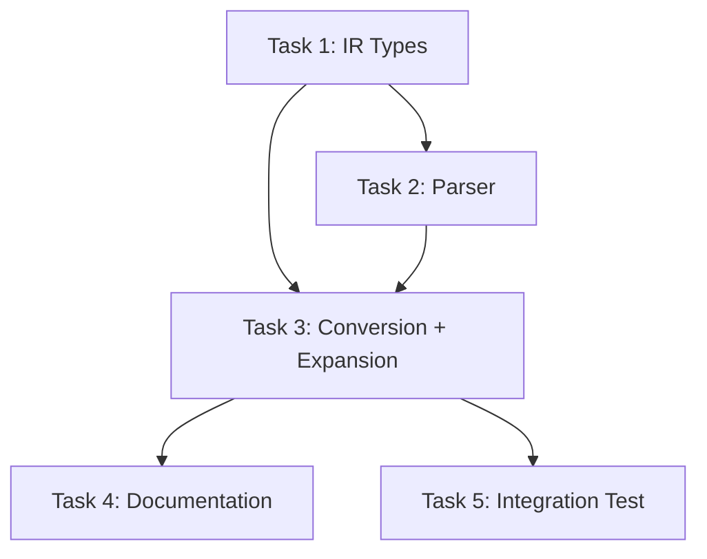

# Labeled Compound Statements — Implementation Plan

Enable `label: std::extract_bytes(...)`, `label: std::route(...)`, and `label: myFn(...)` syntax in CASTM, so that compound statements — not just `cycle` blocks — can be jump targets.

## Current State

| Component | `label` support | Status |
|-----------|----------------|--------|
| `CycleAst` | `label?: string` | ✅ Already exists |
| `StructuredAdvancedStmtAst` | `label?: string` | ✅ Added |
| `StructuredFnCallStmtAst` | `label?: string` | ✅ Added |
| `PragmaAst` | `label?: string` | ✅ Added |

### Root Cause

- `parseLabeledCycleLine()` in `cycle-inline.ts` only matches `label: bundle {`
- `parseStandardAdvancedCall()` in `advanced.ts` requires line to start with `std::` or a known name
- `consumeFunctionPreludeStatement()` in `function-expand-prelude.ts` pushes pragmas directly and fails on labeled lines

---

## Task 1: IR Type Additions

Add `label?: string` to the three AST interfaces that don't have it yet.

### Sub-tasks

- [x] **1.1** In `packages/compiler-ir/src/ast.ts`, add `label?: string` to `StructuredAdvancedStmtAst` (line 192)
- [x] **1.2** In `packages/compiler-ir/src/ast.ts`, add `label?: string` to `StructuredFnCallStmtAst` (line 224)
- [x] **1.3** In `packages/compiler-ir/src/ast.ts`, add `label?: string` to `PragmaAst` (line 100)

### Verification

| Test ID | Command | Expected |
|---------|---------|----------|
| T1-V1 | `npx tsc --noEmit -p packages/compiler-ir/tsconfig.json` | No errors |
| T1-V2 | `npx vitest run tests/compiler-front.structured.test.ts` | All pass |

---

## Task 2: Parser — Labeled Advanced & Fn-Call Parsing

Teach `parseStructuredStatements()` to strip a label prefix before matching advanced/fn-call patterns.

### Sub-tasks

- [x] **2.1** In `packages/compiler-front/src/structured-core/statements.ts`, add helper:
  ```typescript
  function stripLabelPrefix(clean: string): { label: string; rest: string } | null {
    const match = clean.match(/^([A-Za-z_][A-Za-z0-9_]*)\s*:\s*(.+)$/);
    if (!match) return null;
    const keyword = match[1].toLowerCase();
    if (RESERVED_KEYWORDS.has(keyword)) return null;
    // Guard: reject if rest starts with ':' (e.g. std::route → not a label)
    if (match[2].startsWith(':')) return null;
    return { label: match[1], rest: match[2] };
  }
  ```
  Import `RESERVED_KEYWORDS` from `./constants.js`.

  > **Note**: The `::` guard (`match[2].startsWith(':')`) was added during implementation to prevent `std::route(...)` from being mis-parsed as label=`std`, rest=`:route(...)`.

- [x] **2.2** In `parseStructuredStatements()`, **after** `parseFunctionCall()` (line ~127) and **before** the E2002 error (line ~129), insert:
  ```typescript
  const labeled = stripLabelPrefix(clean);
  if (labeled) {
    const advLabeled = parseAdvancedStatement(labeled.rest);
    if (advLabeled) {
      out.push({
        kind: 'advanced',
        name: advLabeled.name,
        args: advLabeled.args,
        text: advLabeled.text,
        namespace: advLabeled.namespace,
        sourceForm: advLabeled.sourceForm,
        label: labeled.label,
        span: spanAt(entry.lineNo, clean.length)
      });
      continue;
    }
    const fnLabeled = parseFunctionCall(labeled.rest);
    if (fnLabeled) {
      out.push({
        ...fnLabeled,
        label: labeled.label,
        span: spanAt(entry.lineNo, clean.length)
      });
      continue;
    }
  }
  ```

### Verification

| Test ID | Description | Expected |
|---------|-------------|----------|
| T2-V1 | Parse `subrC: std::extract_bytes(src=R0, dest=R1, axis=col, byteWidth=8, mask=255);` | `{ kind: 'advanced', name: 'extract_bytes', label: 'subrC' }` |
| T2-V2 | Parse `myLabel: myFn(R0, R1);` | `{ kind: 'fn-call', name: 'myFn', label: 'myLabel' }` |
| T2-V3 | Unlabeled `std::route(...)` still works | `{ kind: 'advanced', label: undefined }` |
| T2-V4 | `mainEntry: bundle { ... }` still parsed as labeled cycle | No regression |

```bash
npx vitest run tests/compiler-front.structured.test.ts
```

---

## Task 3: Structured → Flat Conversion + Function Expansion

Propagate labels through the conversion and expansion pipeline so they reach `PragmaAst` and eventually `CycleAst`.

### Sub-tasks

- [x] **3.1** In `packages/compiler-front/src/structured-core/conversion.ts`, update `emitStructuredBodyAsEntries()`:
  - For `stmt.kind === 'advanced'` (line ~63): prepend `${stmt.label}: ` if `stmt.label` exists
  - For the fn-call fallback (line ~108): prepend `${stmt.label}: ` if `stmt.label` exists

  ```diff
   if (stmt.kind === 'advanced') {
  +  const labelPrefix = stmt.label ? `${stmt.label}: ` : '';
     if (stmt.sourceForm === 'qualified' || stmt.namespace === 'std') {
  -    pushLine(`std::${stmt.name}(${stmt.args});`);
  +    pushLine(`${labelPrefix}std::${stmt.name}(${stmt.args});`);
     } else {
  -    pushLine(`${stmt.text};`);
  +    pushLine(`${labelPrefix}${stmt.text};`);
     }
   }
  ```

  ```diff
   // fn-call fallback:
  -pushLine(`${stmt.name}(${stmt.args.join(', ')});`);
  +const fnLabelPrefix = stmt.label ? `${stmt.label}: ` : '';
  +pushLine(`${fnLabelPrefix}${stmt.name}(${stmt.args.join(', ')});`);
  ```

- [x] **3.2** In `packages/compiler-front/src/structured-core/lowering/function-expand-prelude.ts`, update `consumeFunctionPreludeStatement()`:
  - Before `parseStandardAdvancedCall(clean)`, try `stripLabelPrefix(clean)`:
    - If label found, parse the `rest` with `parseStandardAdvancedCall`
    - On success, push pragma with `label: labelResult.label`

  ```typescript
  // Try labeled advanced statement first
  const labelResult = stripLabelPrefix(clean);
  const toParse = labelResult ? labelResult.rest : clean;
  const advancedPragma = parseStandardAdvancedCall(toParse);
  // ... (existing validation) ...
  kernel.pragmas.push({
    text: advancedPragma.text,
    anchorCycleIndex: kernel.cycles.length,
    ...(labelResult ? { label: labelResult.label } : {}),
    span: spanAt(entry.lineNo, 1, clean.length)
  });
  ```

- [x] **3.3** In `packages/compiler-api/src/passes-shared/expand-pragmas-pass.ts`, after handler expansion (line ~77), propagate label to first generated cycle:

  ```typescript
  if (handler) {
    const prevLen = generatedCycles.length;
    handler(pragma, context);
    // Propagate label to first generated cycle
    if (pragma.label && generatedCycles.length > prevLen) {
      generatedCycles[prevLen].label = pragma.label;
    }
    continue;
  }
  ```

- [x] **3.4** _(Extra, not in original plan)_ In `packages/compiler-front/src/structured-core/lowering/function-expand-call.ts`, update `tryExpandFunctionCall()`: strip label prefix before `parseFunctionCallLine()` and propagate label to first cycle generated by `expandBody()`. Without this, `entry: doWork(R1, R0);` text lines emitted by conversion.ts would not be recognized as function calls.

### Verification

| Test ID | Description | Expected |
|---------|-------------|----------|
| T3-V1 | Lowering `subrC: std::route(@0,1 -> @0,0, payload=R3, accum=R1);` | `PragmaAst` with `{ text: 'route(...)', label: 'subrC' }` |
| T3-V2 | Full compile of kernel with `myLabel: std::extract_bytes(...)` | First generated cycle has `label: 'myLabel'` |
| T3-V3 | Existing tests pass | No regression |

```bash
npx vitest run tests/compiler-front.structured.test.ts
```

---

## Task 4: Documentation Updates

### Sub-tasks

- [x] **4.1** Update `docs/language/grammar.md`:
  - Add `label` production: `label ::= ident`
  - Update `kernel_item` to: `kernel_item ::= ... | labeled_stmt`
  - Add `labeled_stmt ::= label ":" (cycle_block | advanced_stmt | function_call)`

- [x] **4.2** Update `docs-site/language/grammar.md`:
  - Mirror the same grammar changes from 4.1

- [x] **4.3** Create `docs-site/features/labels.md`:
  - Feature page explaining labeled statements
  - Syntax: `label: statement`
  - Supported types: cycle blocks, advanced statements (`std::*`), function calls
  - Examples:
    ```dsl
    subrC: std::extract_bytes(src=R0, dest=R1, axis=col, byteWidth=8, mask=255);
    mainEntry: bundle { at all: LWI R0, 0; }
    loadPhase: loadValues(R0, 720);
    ```
  - Semantics: label attaches to the first cycle emitted by the compound statement

- [x] **4.4** Update `docs-site/features/index.md` to reference the new labels page

### Verification

| Test ID | Description | Expected |
|---------|-------------|----------|
| T4-V1 | `docs/language/grammar.md` contains `labeled_stmt` | grep match |
| T4-V2 | `docs-site/features/labels.md` exists with ≥ 2 examples | File exists, ≥ 2 code blocks |
| T4-V3 | `docs-site/features/index.md` references labels | grep match |

---

## Task 5: Integration Test — v15 S-Box Compilation

End-to-end validation with a real kernel using labeled compound statements.

### Sub-tasks

- [x] **5.1** Create integration test using labeled compound statements:
  - Created `examples/integration/labeled-compound-test.castm` with all 3 labeled forms: labeled cycle, labeled `std::route(...)`, labeled function call.
  - Added E2E vitest test (T5-V1) in `compiler-front.structured.test.ts` using `compile()` from `compiler-api` — verifies `mainEntry`, `routePhase`, and `loadPhase` labels appear on output cycles.

  > **Note**: The original v15 file uses labeled **cycles** only. Rather than rewriting the complex v15 kernel, a purpose-built test kernel exercises the new labeled-advanced-stmt and labeled-fn-call features.

- [x] **5.2** Compile: `npx tsx scripts/sbox/stats.ts --file ./examples/dsl_port/sbox_k7_v15_jump.edsl`
  - Ran in `UMA-CGRA-Simulator/` (not `CASTM/`). Result: 69 CompCyc / 210 ExecCyc / 364 LatCC / OK=YES (3 schedulers).
  - Validates no regression on existing labeled-cycle code.

- [x] **5.3** Run parity: `npx tsx scripts/sbox/parity.ts`
  - Result: ✅ ALL PASS (12 values × 4 implementations)

### Verification

| Test ID | Description | Expected |
|---------|-------------|----------|
| T5-V1 | Compilation succeeds | No errors |
| T5-V2 | Metrics | 69 CompCyc / 210 ExecCyc / 364 LatCC |
| T5-V3 | Parity | `OK=YES` for all 256 S-Box values |

---

## Execution Order



## Files Modified

| File | Package | Change |
|------|---------|--------|
| `packages/compiler-ir/src/ast.ts` | compiler-ir | Add `label?` to 3 interfaces |
| `packages/compiler-front/src/structured-core/statements.ts` | compiler-front | `stripLabelPrefix()` + labeled parsing |
| `packages/compiler-front/src/structured-core/conversion.ts` | compiler-front | Emit label prefix in structured→flat |
| `packages/compiler-front/src/structured-core/lowering/function-expand-prelude.ts` | compiler-front | Handle labeled pragmas |
| `packages/compiler-front/src/structured-core/lowering/function-expand-call.ts` | compiler-front | Strip label before fn-call parse + propagate to first cycle |
| `packages/compiler-api/src/passes-shared/expand-pragmas-pass.ts` | compiler-api | Propagate label to first generated cycle |
| `tests/compiler-front.structured.test.ts` | tests | 7 new test cases (T2-V1..V4, T3-V1..V2, T5-V1 E2E) |
| `examples/integration/labeled-compound-test.castm` | examples | **[NEW]** Integration test EDSL file |
| `docs/language/grammar.md` | docs | Grammar update (`labeled_stmt`, `label`) |
| `docs-site/language/grammar.md` | docs-site | Grammar update (`labeled_stmt`, `label`) |
| `docs-site/features/labels.md` | docs-site | **[NEW]** Feature page |
| `docs-site/features/index.md` | docs-site | Reference new page |
